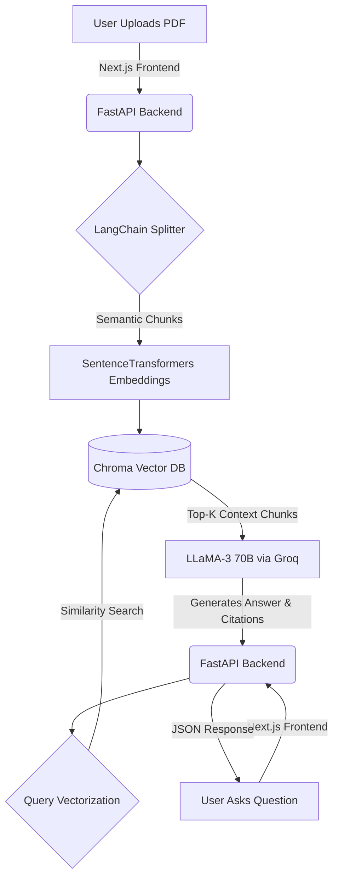

<div align="center">
  <h1>🚀 Lexica-AI</h1>
  <h3>Enterprise-Grade Retrieval-Augmented Generation (RAG) System</h3>
  
  <p>
    <b>A Full-Stack AI application that allows users to upload massive PDF documents and interact with them in real-time, backed by exact page and document citations.</b>
  </p>

  <div>
    
    
    
    
  </div>
</div>

---

## 🌟 Key Features

- **🧠 Advanced RAG Engine:** Leverages LangChain Expression Language (LCEL) to natively connect Vector Databases to Large Language Models.
- **📚 Multi-Document Ingestion:** Instantly parses and semantically chunks large PDF files using `RecursiveCharacterTextSplitter`.
- **🔍 Vector Similarity Search:** Uses open-source `SentenceTransformers` and **ChromaDB** to run high-speed, local similarity searches on your data.
- **⚡ Ultra-Fast Inference:** Integrated with the Groq API (LLaMA-3 70B) for lightning-fast natural language generation.
- **🎯 Precise Citations:** An engineered extraction pipeline that completely eliminates AI hallucination by citing the exact source file and page number.
- **💎 Premium Glassmorphism UI:** A sleek, modern, dark-mode web interface built entirely from scratch with Vanilla CSS and React.

---

## 🏗️ Architecture



---

## 🛠️ Tech Stack

**Frontend:**
- Next.js (App Router)
- React.js
- Custom Glassmorphism Vanilla CSS

**Backend:**
- Python 3.11
- FastAPI / Uvicorn
- LangChain (LCEL Pipeline)
- ChromaDB (Local Vector Store)
- HuggingFace `all-MiniLM-L6-v2`
- Groq API (Inference)

---

## 🚀 Getting Started

### 1. Start the Backend API
Navigate to the `backend` directory and start the Uvicorn server:
```bash
cd backend
pip install -r requirements.txt
uvicorn main:app --reload
```

### 2. Start the Frontend Application
Open a new terminal, navigate to the `frontend` directory, and start the Next.js app:
```bash
cd frontend
npm install
npm run dev
```

### 3. Open the App
Visit `http://localhost:3000` in your web browser. Drag and drop a PDF into the glowing panel, and start chatting with your data!

---
*Built with ❤️ for modern ML Engineering portfolios.*
